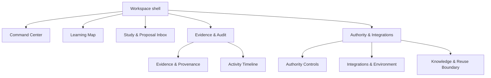
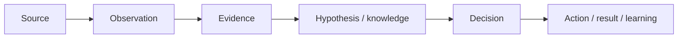
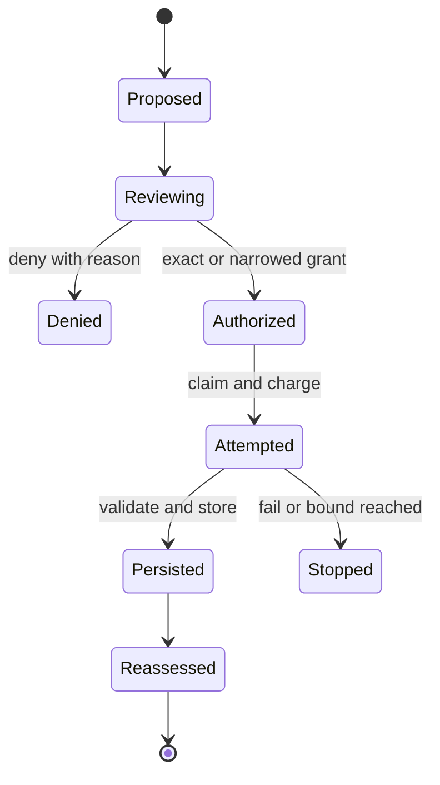

# ORION operating workspace UX contract

## Status and scope

This document completes the design-only deliverables in issue #33. It defines
the interaction model and durable UI contract for an operating intelligence
workspace. It does not select a frontend framework, expose customer values, or
grant execution authority.

The product test is simple:

> A user can tell what ORION knows, what it is studying, why it is uncertain,
> what it proposes, what is authorized, what happened, and what needs attention
> without treating confidence as permission.

The amendment test remains binding: replacing the frontend must not change
ORION core. The expansion test also remains binding: another system, tenant,
industry, evidence channel, or knowledge volume must fit without vendor-shaped
navigation.

## Primary users and decisions

| Role | Primary question | May decide | Must not infer from UI |
| --- | --- | --- | --- |
| Operations lead | Where does human attention change an outcome? | Priorities and bounded operational approvals | High confidence means action is authorized |
| Domain steward | Is this interpretation operationally correct? | Validate, contradict, or defer a hypothesis | A proposal has changed source data |
| Authority owner | What exact scope, cost, and consequence is requested? | Approve, narrow, deny, expire, or revoke authority | Read authority includes write authority |
| Evidence reviewer | What supports this conclusion and is it still current? | Accept evidence quality, flag contradiction, request review | Aggregate evidence reveals raw records |
| Integration operator | Is a source healthy and within its capability boundary? | Configure a connection and disable a capability | Connection health grants study authority |
| Auditor | Who or what changed state, under which authority, and with what result? | Record a finding or export a scoped audit view | Attempted execution equals verified success |
| Executive observer | Is ORION reducing operational uncertainty and work safely? | Set objectives and escalation expectations | Activity volume equals business value |

One person may hold several roles. Permissions are evaluated per action, tenant,
resource scope, time window, and environment; a role label alone is never an
authorization envelope.

## Information architecture

The global shell contains a tenant/environment selector, an operating-state
summary, global search, attention inbox, and current-role menu. Customer names
are shown only to authorized users; otherwise the selector uses a safe local
alias.

Navigation labels are capability-neutral. Vendor names may appear as adapter
details inside Integrations, never as primary navigation.

### Cross-surface object links

Every visible object has a stable UI reference and links to its adjacent trust
objects:

| Object | Links to |
| --- | --- |
| Objective | active studies, unresolved areas, verified outcomes |
| Study proposal | rationale, expected information gain, requested authority, evidence gap |
| Study run | authorization decision, activity events, evidence batch, stop reason |
| Observation | source class, collection time, validation result, evidence reference |
| Hypothesis | supporting and contradicting evidence, status history, next question |
| Recommendation | knowledge basis, uncertainty, policy result, required human decision |
| Authority envelope | grantor, scope, capability, budget, expiry, uses, revocation history |
| Action attempt | authority snapshot, request digest, execution result, verification result |

Raw identifiers and values are not placed in URLs, notifications, analytics, or
default titles.

## Canonical presentation state

The UI consumes a provider-neutral read model assembled outside the core domain.
It does not mutate domain objects directly.

| UI concept | Required fields | Domain source | Presentation rule |
| --- | --- | --- | --- |
| Operating state | mode, health, active objective, last verified transition | orchestration/checkpoint reports | `LEARNING`, `WAITING`, `BLOCKED`, or `DEGRADED`; never “autonomous” alone |
| Knowledge item | epistemic status, confidence, evidence count, recency, contradictions | graph, metadata, hypothesis and knowledge contracts | Status and provenance precede confidence |
| Study proposal | kind, neutral target, rationale components, bounds, requested capability | study opportunity/intent | Always labeled `PROPOSAL`; no approval styling |
| Authorization | capability, scope, budget, expiry, status, grantor | authorization envelope/claim | Scope displayed before action controls |
| Run progress | stage, bounded counters, stop condition, persistence verification | study run/checkpoint/report | Attempted, persisted, and verified counts remain distinct |
| Activity event | safe type, time, run/cycle reference, stage, result code | future neutral activity event | Append-only display; no payload values |
| Evidence summary | class, count, source diversity, age, validation and contradiction state | evidence/provenance contracts | Aggregate-safe by default |
| Action outcome | proposed, authorized, attempted, executed, verified | policy, Hand, verification contracts | Each state is a separate timestamped step |

### State vocabulary

The interface uses these durable terms consistently:

- `UNKNOWN`: no adequate evidence.
- `OBSERVED`: a source-bound observation exists.
- `HYPOTHESIS`: an interpretation is under evaluation.
- `SUPPORTED`: current evidence supports the interpretation within its scope.
- `CONTRADICTED`: material evidence conflicts.
- `STALE`: evidence or source binding changed.
- `INVALIDATED`: the prior conclusion must not be used.
- `PROPOSED`: ORION requests a study or action; no authority follows.
- `AUTHORIZED`: an exact current envelope permits a bounded capability.
- `DENIED`: policy or authority rejected the exact request.
- `ATTEMPTED`: a bounded request was charged before transport.
- `PERSISTED`: validated evidence was durably stored.
- `VERIFIED`: the claimed result was independently checked.
- `STOPPED`: a declared budget, duration, non-progress, failure, or user stop ended the run.

Confidence is displayed only beside epistemic status, scope, evidence count, and
recency. It is never rendered as a green approval badge.

## Primary surfaces

### Command Center

User task: understand current operating posture and address the smallest number
of consequential exceptions.

Reading order:

1. operating mode and authority ceiling;
2. active objective and current bounded run;
3. human attention queue;
4. high-value unresolved areas;
5. recent verified outcomes;
6. integration health.

| Region | Contents | Interaction |
| --- | --- | --- |
| State strip | `READ_ONLY / LEARNING`, health, last checkpoint, writes counter | opens exact authority and health evidence |
| Active work | objective, stage, target class, remaining budget/time, stop rule | opens study run; no inline “run” action |
| Attention queue | expiring authority, contradictions, blocked persistence, review requests | keyboard-sortable by consequence and urgency |
| Unresolved areas | uncertainty, relevance, information-gain estimate, evidence age | opens Learning Map at selected gap |
| Outcomes | verified improvements, abstentions, failures, rollbacks | opens causal audit slice |
| Health | adapter capability and last safe check | opens neutral integration detail |

No vanity totals, animated activity feed, or single “AI confidence” score appears.

### Learning Map

User task: explore what is understood and find the most valuable unresolved
relationship without losing provenance.

The default is an accessible table/tree hybrid, not an unbounded force-directed
graph. A graph view is optional for local neighborhoods and always has an
equivalent keyboard-navigable list.

Filters include tenant-safe scope, concept type, epistemic status, evidence
coverage, contradiction, recency, and objective relevance. Selecting a node
opens attributes, relationships, status history, evidence summary, and proposed
next questions. Customer values stay collapsed behind explicit scoped access.

### Study & Proposal Inbox

User task: adjudicate only proposals that require human authority or domain
judgment.

| Column | Meaning |
| --- | --- |
| Why now | uncertainty reduction, objective relevance, novelty, contradiction, drift |
| Requested scope | tenant alias, capability, neutral entity/field class, record/read bounds |
| Cost and risk | external reads, compute, duration, persistence, risk tier |
| Existing evidence | counts, diversity, age, known contradictions |
| Stop conditions | exact budget, duration, non-progress and failure stops |
| Decision | approve exact, narrow, deny with reason, or defer until a date/event |

Approval uses a review screen, never a one-click table action. The review screen
shows a semantic diff between requested and granted scope. Narrowing never
silently changes ORION's proposal; it creates a distinct authorization record.

### Evidence & Provenance

User task: determine whether a conclusion is adequately supported without
default exposure of customer records.

The summary shows evidence classes/counts, independent source count, observation
window, validation status, contradictions, freshness, and transformation chain.
The lineage view is:

Each edge opens its timestamp, producer, contract version, and verification
state. Raw payload access requires a separate role/scope check and is never
included in copied links or exports by default.

### Authority Controls

User task: know exactly what ORION may do now and change only a bounded grant.

The authority ladder is presented as distinct capabilities:

`Read → Analyze → Recommend → Simulate → Draft → Execute → Verify`

Expanded authority is a new grant, not the final step of a progress meter. Each
grant shows scope, capability, environment, budgets, time window, preconditions,
remaining uses, last use, and revocation control. The default view emphasizes
denied and absent capabilities as clearly as granted ones.

### Activity & Audit Timeline

User task: reconstruct what happened from proposal through verification.

Events are grouped by correlation/run, then ordered by durable event time with
ingest time available. Filters cover actor, capability, stage, decision, result,
and verification. The timeline distinguishes:

- proposed from authorized;
- authorized from attempted;
- attempted from externally executed;
- executed from verified;
- evidence persisted from evidence merely returned;
- stopped safely from completed successfully.

Exports are scope-filtered, watermarked with export time and requester, and do
not include raw customer payloads unless separately authorized.

### Integrations & Environment

User task: configure and diagnose capabilities without confusing connectivity
with permission.

Cards are avoided as the primary model; a dense capability table shows source,
environment, capability, health, last safe check, data direction, and current
authority state. Vendor-specific configuration lives in adapter panels. A
successful connection test proves transport only and never changes authority.

### Knowledge & Reuse Boundary

User task: verify where knowledge may be used.

Three visibly separate scopes are mandatory:

| Scope | Examples | Default movement |
| --- | --- | --- |
| Customer-local | observations, identities, transactions, local policy | never leaves tenant scope |
| Generalized capability | safe procedure/adapter knowledge without customer facts | promotion requires explicit verification and policy |
| Public/certified reference | standards, official documentation, certified rules | usable only with provenance and applicability checks |

The UI never uses “shared learning” without naming the exact scope and evidence
that is excluded.

## Low-fidelity layouts

### Command Center layout

| Width | First region | Second region | Third region |
| --- | --- | --- | --- |
| Desktop ≥ 1200 px | full-width state/authority strip | 2/3 active work + 1/3 attention queue | unresolved areas, outcomes, health tables |
| Compact 768–1199 px | state strip wraps into two rows | active work then attention queue | remaining tables in reading order |
| Narrow < 768 px | sticky state summary | single-column attention-first flow | tables become labeled rows; graphs use list mode |

### Proposal review layout

| Region | Desktop | Narrow |
| --- | --- | --- |
| Context | left summary rail | first disclosure section |
| Evidence/rationale | center, default open | second disclosure section |
| Requested vs granted scope | side-by-side semantic diff | stacked requested then granted |
| Decision controls | sticky right/bottom panel | final full-width step |

### Evidence detail layout

| Region | Default representation | Alternate |
| --- | --- | --- |
| Status | text + icon + timestamp | screen-reader summary |
| Lineage | vertical step list | local Mermaid-like node graph in implementation |
| Evidence | aggregate table | scoped raw drawer after permission check |
| History | chronological changes | compare two versions |

### Remaining surface wireframes

| Surface | Desktop reading order | Narrow reading order |
| --- | --- | --- |
| Learning Map | filters → scoped table/tree → local relationship view → selected-node evidence panel | filters drawer → result list → node detail → relationships → evidence |
| Authority | operating ceiling → active/expiring grants table → selected scope diff → revocation history | ceiling → exceptions → grant list → scope detail → revoke action |
| Audit | correlation search → stage/result filters → grouped timeline → selected event lineage | search → filters drawer → event list → selected lineage → export action |

These are structural sketches, not framework components. Each region retains the
same semantics and order when its visual implementation changes.

## Workflow prototypes

### Approve a bounded study

The user sees requested and granted scope, budget, expiry, and stop rules before
authorization. A stale proposal returns to `Proposed` with a visible reason; it
cannot inherit the old decision.

### Investigate a contradiction

1. Attention queue identifies the contradicted hypothesis.
2. Evidence view compares supporting and contradicting sources.
3. User records domain context or requests a bounded study.
4. ORION creates a new proposal; it does not reinterpret the click as authority.
5. Reassessment records `SUPPORTED`, `CONTRADICTED`, `STALE`, or `UNKNOWN` with
   provenance.

### Audit an action

1. Search by safe run/action reference.
2. Inspect proposal, authorization snapshot, charged attempt, adapter result,
   and verification as separate events.
3. Confirm scope and counters at each boundary.
4. Export only the authorized aggregate audit slice.

## Empty, loading, failure, and stale states

| State | Required behavior |
| --- | --- |
| Empty | Explain whether there is no data, no permission, no proposal, or no matching filter; never conflate them |
| Loading | Preserve headings and last verified timestamp; avoid invented progress percentages |
| Partial | Mark unavailable regions and retain verified regions; do not recompute a global “healthy” state |
| Error | Show safe category, affected boundary, last verified state, retry ownership, and audit reference; no raw exception |
| Stale | Keep prior value visible but labeled stale with the invalidating event and refresh path |
| Denied | State which capability/scope was denied and confirm no attempt was charged when applicable |
| Interrupted | Show charged attempts, persisted evidence, replay status, and next permitted recovery action |

Watcher or rendering failure never changes a study or action. The UI reconnects
from durable read state and clearly marks any event gap.

## Accessibility baseline

- WCAG 2.2 AA is the minimum target.
- All functions are keyboard reachable with visible focus and logical order.
- Status uses text and shape/icon, never color alone.
- Tables expose headers, sort state, captions, and row actions accessibly.
- Graph content has an equivalent hierarchical list and meaningful summaries.
- Live updates use restrained `aria-live` announcements; high-volume activity is
  batched so it does not overwhelm assistive technology.
- Motion respects reduced-motion preferences and is never required to understand
  state change.
- Target size, zoom to 200%, reflow at 320 CSS pixels, contrast, and text spacing
  are acceptance checks.
- Dates show timezone; relative time always exposes the exact timestamp.
- Confidence and numeric risk indicators include plain-language meaning and
  evidence context.
- Destructive/revocation actions require a labeled confirmation describing the
  exact affected scope, not a generic “Are you sure?” dialog.

## Visual system principles

- Calm, dense, and operational: typography and alignment carry hierarchy.
- Use whitespace to separate trust boundaries, not to inflate sparse cards.
- Semantic color is restrained and backed by text/icon labels.
- Monospace is reserved for immutable references, digests, counters, and code.
- Motion indicates a verified transition or changed data, never “AI thinking.”
- Charts appear only when they reveal trend, distribution, comparison, or
  topology better than a table.
- Confidence is not a gauge. Authority is not a progress bar.
- Dark and light themes preserve semantic contrast and identical hierarchy.

## Stable frontend boundary

The eventual frontend depends on neutral query/command contracts:

- query operating summary, attention items, learning neighborhood, proposals,
  evidence summary, authority envelopes, activity events, and integration health;
- submit domain validation, proposal decision, bounded authority change,
  revocation, and safe export request;
- subscribe to sanitized activity events as an optional projection.

Commands carry expected version/digest and idempotency identity. The application
layer reauthorizes every command. UI state, hidden buttons, and route access are
not security boundaries. Framework-specific view models remain outside core.

## Prototype and acceptance plan

The first clickable prototype should use synthetic data and cover three tasks:

1. find and adjudicate one bounded study proposal;
2. trace one conclusion back to evidence and contradiction history;
3. audit one attempted action through independent verification.

Test with at least one operations lead, one domain/authority reviewer, and one
auditor. Measure task completion, scope-comprehension errors, proposal-versus-
authorization confusion, provenance retrieval, keyboard completion, and time to
identify the required human decision.

The design passes only when participants can correctly answer:

- What does ORION know versus merely hypothesize?
- What exact action is proposed?
- What exact scope is authorized now?
- What was attempted, persisted, and verified?
- What evidence supports the state?
- What requires a human, and why?

No production frontend stack is selected until this prototype exposes no
material confusion between evidence, confidence, proposal, authority,
execution, and verification.
